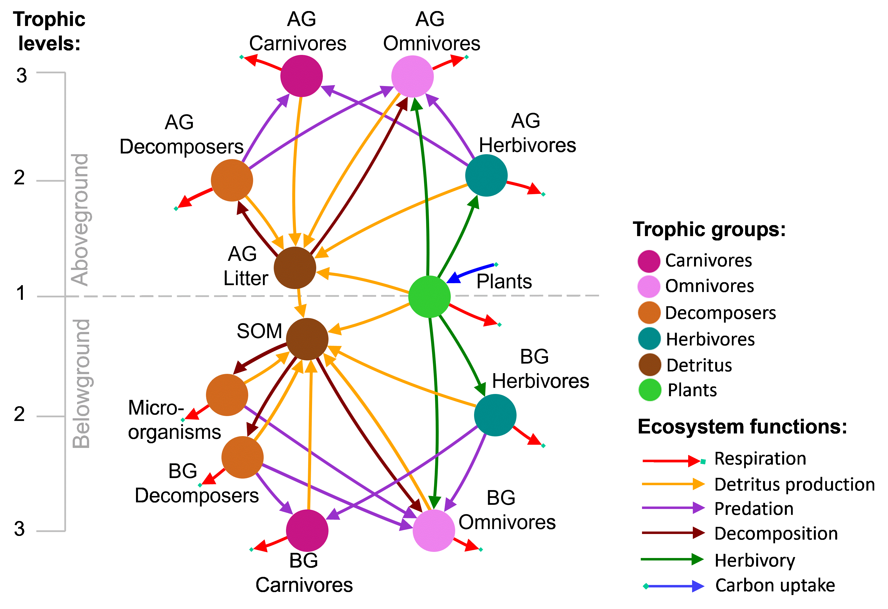

# Code for 
# Buzhdygan et al. (2023) Ecology (in preparation)

# "Plant diversity facets affect energy dynamics in grasslands depending on trophic contexts" (preliminary title)

# Analysis 
Contains codes for testing the effects of plant diversity facets on each stock and flow across the food web and how these effects vary with trophic groups, trophic levels, ecosystem functions, and between aboveground and belowground subnetworks: 

