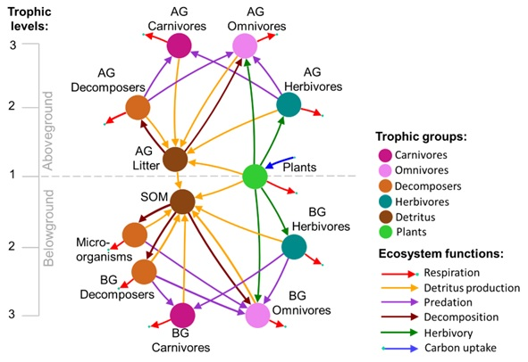

# Code for Buzhdygan et al. (2023) Ecology  (in preparation)

# Preliminary title  "Plant diversity facets affect energy dynamics in grasslands depending on trophic contexts"

# Analysis 
Contains codes for testing the effects of each diversity facet on each stock and flow across the food web diversity facets: "sowndiv" - species richness, "numfg" - number of functional groups, "leg.ef" - presence of legumes, "gr.ef" - presence of grasses, "sh.ef" - presence of short herbs, "th.ef"- presence of tall herbs.

